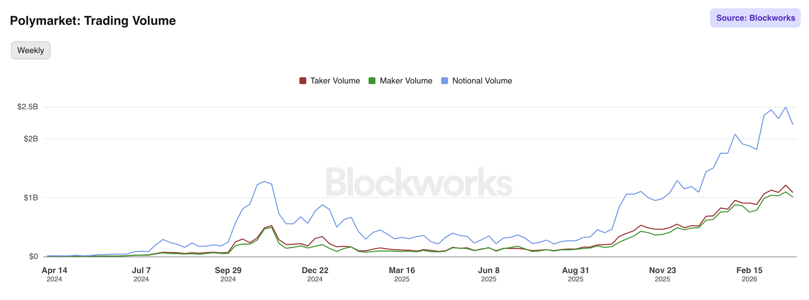
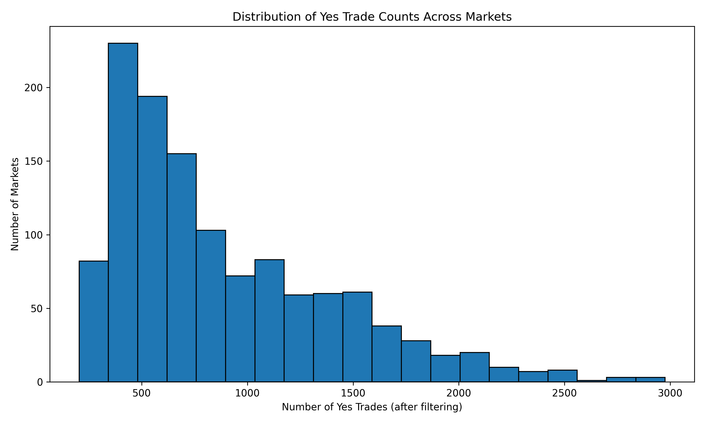
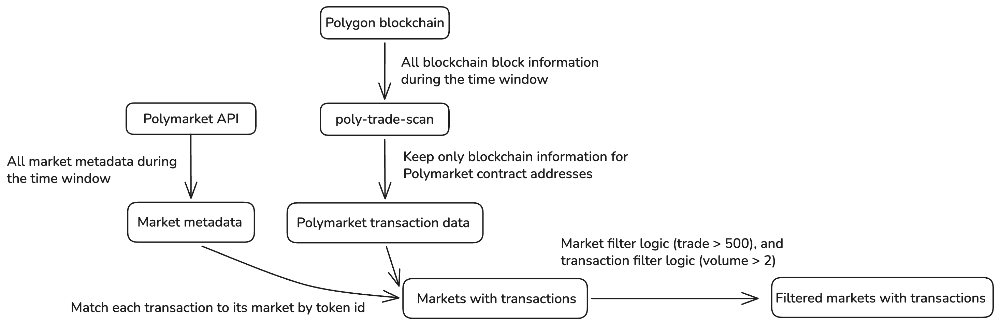
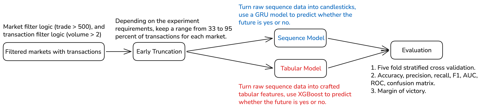
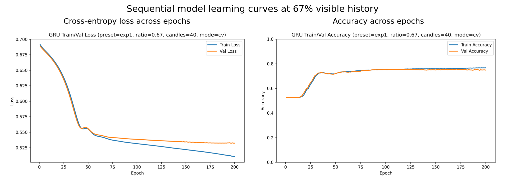
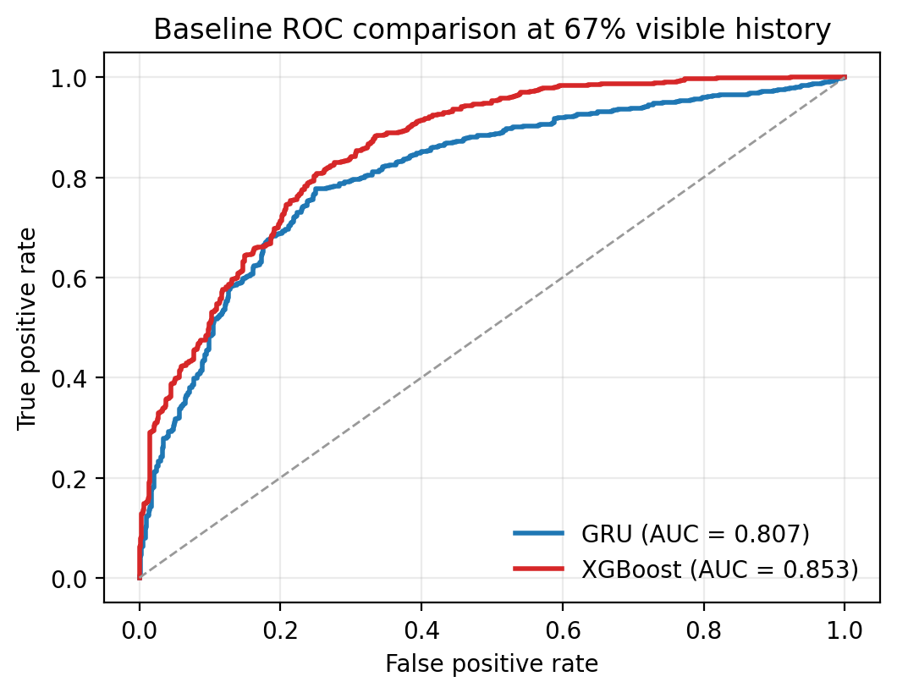
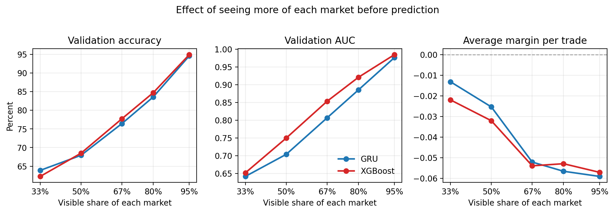
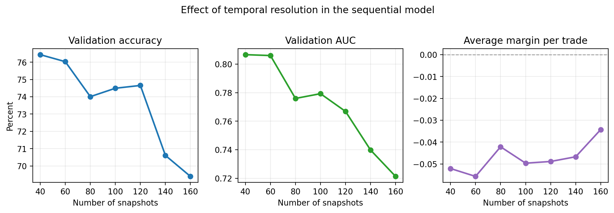
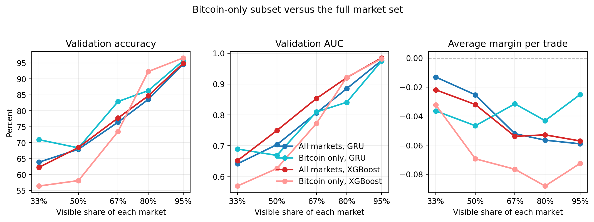

# Artificial Intelligence Project #1 Supervised Learning Report

**Student**: 414551003 Yong-Cheng Liaw

The dataset Github link: https://github.com/DandinPower/prediction-market-analysis

## Research Question and Motivation

Prediction markets such as Polymarket [1] and Kalshi [2] have emerged as important tools for forecasting real world events. In particular, decentralized blockchain based platforms like Polymarket enable trading on a wide range of topics, including politics, economics, and entertainment, while providing transparent and publicly verifiable market data. These markets aggregate dispersed information into probabilistic forecasts through price signals driven by financial incentives [3]. Recent studies show that such markets can act as real time indicators of public sentiment and, in some cases, provide competitive or complementary forecasting performance compared to traditional polling methods [4]. This shows the strong adoption of prediction markets, as illustrated in Figure 1 from 2024 to 2026.


Figure 1: Polymarket trading volume from 2024 to 2026 (source: Blockworks Analysis [5])

This opens a new avenue for research. Prediction market data might contain more efficient information than raw data, since it may include insider information and public sentiment. It could provide more accurate predictions than raw data. For example, in the past we trained sequence models to predict stock market movements based on historical price data, but what about using prediction market data to predict stock market movements. Unlike raw data, which always lags behind the current time, prediction market data may include forward looking information. Therefore, using information from prediction markets, for example whether a stock will go up or down the next day, to predict stock market movements might have an advantage over using raw data such as historical price data.

Therefore, in this project, I will explore the potential of using prediction market data to predict real world events by gathering data from the Polymarket official API and crawling detailed transaction data from the raw blockchain, which the official API does not provide, to train different supervised learning models on different events.

## Dataset Introduction

The dataset used in this project is not a generic collection from the Polymarket official API. It is a reconstructed transaction level corpus built from postprocessed Polymarket data and raw blockchain block data. After preprocessing, the datasets are stored in a standalone folder with many subfolders corresponding to each filtered market. In total, the processed corpus contains 6,010 markets, all of which were opened and settled during the short observation window from 2025-12-25 to 2025-12-31. This is clearly not a long historical panel, but it is still dense enough to expose the microstructure of active prediction markets during a period with many short horizon contracts. The reason for this narrow time window is that the raw blockchain data is very large and expensive to process. The public free endpoint of Polygon, the blockchain where Polymarket is built, usually has a rate limit, and since Polygon contains not only Polymarket transactions but also many other applications that run on the same blockchain, it is not possible to obtain all the data from a long time window without using a paid API or running for a very long time. Therefore, I chose to focus on a short time window that contains many active markets, which allows me to obtain a rich dataset while still being able to process it in a reasonable time frame.

The dataset for each market contains a JSON file called `metadata.json`. This file provides the surrounding context, including the market question being traded, the resolution source, the opening and closing times, the market slug, total volume, and the final resolved outcome. In other words, it tells us what the market was about and how it should ultimately be judged. The paired `yes.csv` and `no.csv` files then show how traders actually interacted with that question over time. These trade files retain the block number, timestamp, transaction hash, wallet address, buy or sell direction, token quantity, execution price, and the dollar value of each trade.

The following is an example of transaction CSV:

```csv
block_number,timestamp,tx_hash,wallet,side,tokens,price,total_usdc
80826575,2025-12-26T18:06:33+00:00,0xd562783,0x06b694,BUY,29.4117,0.51,15.0
80835449,2025-12-26T23:02:21+00:00,0x4358933,0x5ad818,BUY,19.6078,0.51,10.0
80836619,2025-12-26T23:41:21+00:00,0x673d0ec,0x6258f5,BUY,2.0784,0.51,1.06
80836818,2025-12-26T23:47:59+00:00,0x1db6fd8,0x6258f5,SELL,2.07,0.5,1.035
```

And the following is an example of metadata JSON:

```json
{
  "question": "Bitcoin Up or Down - December 26, 7PM ET",
  "resolution_source": "https://www.binance.com/en/trade/BTC_USDT",
  "startDate": "2025-12-25T00:01:14.798898Z",
  "endDate": "2025-12-27T01:00:00Z",
  "total_volume": 61513.576147,
  "outcome": "yes",
  "trade_count": 1951,
  "yes_trade_count": 995,
  "no_trade_count": 956,
  ... other metadata fields ...
}
```

The following are some overall dataset statistics.

| Metric           |  Value |
| ---------------- | -----: |
| Original Markets |   6011 |
| Filtered Markets |   1235 |
| Yes Count        |    650 |
| No Count         |    585 |
| Yes Ratio        | 0.5263 |
| No Ratio         | 0.4737 |

Table 1: Summary statistics of the dataset after filtering for resolved markets.

The table shows that this dataset is relatively balanced between yes and no outcomes, with a slight skew toward yes, approximately 52.6 percent. No missing or unresolved outcomes remain, which is favorable for supervised learning. However, the filtering step reduces the dataset size significantly, approximately 20.5 percent retained, which may impact statistical power.

| Market Type    | Count |  Ratio |
| -------------- | ----: | -----: |
| crypto_bitcoin |   689 | 0.5579 |
| crypto_other   |   520 | 0.4211 |
| nfl            |     2 | 0.0016 |
| nba            |     5 | 0.0040 |
| cfb            |     6 | 0.0049 |
| others         |    13 | 0.0105 |
| **Total**      |  1235 | 1.0000 |

Table 2: Market type distribution in the dataset.

The table shows that this dataset is heavily dominated by crypto related markets, approximately 97.9 percent combined, particularly Bitcoin. Traditional sports categories such as NFL, NBA, and CFB are almost negligible. This introduces a strong domain bias, meaning models trained on this data will likely generalize poorly outside crypto contexts unless rebalanced or augmented. The main reason the dataset is dominated by crypto related markets is that during the short time window, a large portion of active markets on Polymarket were filtered out because I limited both the start time and end time to be between 2025-12-25 and 2025-12-31, which is a period with many short horizon contracts. Many diverse markets, such as politics, may run for more than one month, so they are not included in the dataset. This can be improved in the future by expanding the time window and including more markets.


Figure 2: Distribution of trade counts across markets.

Since the dataset is reconstructed from raw blockchain data, it contains detailed transaction level information that is not available in the official API. This allows for more granular analysis of trading behavior and market dynamics. For example, we can analyze the distribution of trade counts across markets, as shown in Figure 2. After filtering to exclude unresolved markets and those number of transactions per market is below 500. The distribution is highly skewed, with a few markets having a large number of transactions, while most markets have relatively few transactions, around 500 to 1000 transactions.


## Detail Approach for Dataset Crafting and Preprocessing

### Polymarket Gamma API

Polymarket exposes several public interfaces, but for dataset construction the most important one is the Gamma API, which serves as the market discovery layer of the platform [6]. The official documentation describes Gamma as the primary read only API for browsing markets, events, and related metadata, while the `/markets` endpoint returns the detailed fields needed to identify each binary contract, including the market question, opening and closing dates, resolution source, and the CLOB token identifiers for the YES and NO sides [6][7]. In this project, `preprocessing.fetch` uses `https://gamma-api.polymarket.com/markets` with `closed=true`, pagination through `limit` and `offset`, and date constraints on `end_date_min` and `end_date_max`. The local pipeline then applies an additional filter requiring `startDate` to be later than `2025-12-25T00:00:00Z`, so the retained metadata aligns with the short observation window used for the blockchain scan.

Gamma metadata is useful because it provides semantic context that raw chain data does not contain. A Polygon transaction can tell us that a wallet traded a token, but it does not directly tell us the human readable forecasting question or the final resolved label. The repository therefore postprocesses the Gamma response by parsing `outcomePrices` and converting fully resolved binary markets into a supervised learning label, where `["1","0"]` is mapped to a final outcome of `yes` and `["0","1"]` is mapped to `no`. This step transforms market metadata from a descriptive catalog into a clean label source that can later be joined with transaction level records.

### Polygon Blockchain Data and Poly-trade-scan Toolkit

The second half of the dataset comes from Polygon PoS, the EVM compatible chain on which Polymarket trading activity is settled [8]. Polygon provides public HTTPS RPC and WebSocket endpoints for chain access, and these endpoints follow the Ethereum JSON-RPC model, where blocks contain transactions and transaction receipts contain execution logs that can be decoded into application specific events [8][9]. This architectural detail matters for the project because Polygon is a shared chain rather than a Polymarket only database. A raw block range therefore contains transactions from many unrelated decentralized applications, and Polymarket trades must be reconstructed by scanning blocks and then decoding only the fills associated with Polymarket contracts and outcome tokens.

To operationalize this step, the project relies on the open source `poly-trade-scan` toolkit [10]. According to its documentation, the tool can either listen to Polygon blocks in real time through WebSocket or download historical trades over a specified block interval, exporting the results to CSV [10]. The preprocessing pipeline uses the historical mode, because the objective is to reconstruct a complete past window instead of monitoring new trades. The relevant block span to `80750701` through `81053200`, which covers the period from 2025-12-25 to 2025-12-31, and notes that scanning this entire window can take about one day on free RPC infrastructure. The scanner output is already close to the format needed downstream, because each row contains `block_number`, `timestamp`, `tx_hash`, `wallet`, `token_id`, `side`, `tokens`, `price`, and `total_usdc`. Among these columns, `token_id` is the critical bridge back to Gamma metadata, since it uniquely identifies which YES or NO outcome token was traded.


### Complete Dataset Crafting Process



Figure 3: Overview of the dataset crafting process.

| Stage | Main operation | Output used in this project |
| --- | --- | --- |
| Market discovery | Query Gamma `/markets`, paginate over closed markets in the target date range, and derive the binary label from `outcomePrices` | Market metadata with `question`, `startDate`, `endDate`, `resolutionSource`, `clobTokenIds`, and final `outcome` |
| Chain scan | Download historical Polygon trades across blocks `80750701` to `81053200` with `poly-trade-scan` | Raw trade rows with `token_id`, wallet, side, price, size, and timestamp |
| Token based matching | Parse each market's YES and NO token IDs, build a lookup table, and stream all trade CSV rows into the correct market side | `datasets/mapped_markets/<market_id>/metadata.json`, `yes.csv`, and `no.csv` |
| Market level filtering | Keep only mapped markets with at least minimal activity, then retain analysis markets with `yes_trade_count > 500` | 6,010 mapped market folders, of which 1,235 remain in the final analysis set |
| Trade level filtering | Keep informative YES side trades with `BUY`, `price < 0.98`, and `total_usdc > 2.0` | Cleaner sequences for visualization and downstream modeling |

Table 3: Stage by stage summary of the dataset crafting and preprocessing pipeline.

Figure 3 and Table 3 summarize the full preprocessing workflow as a join between a semantic source and an execution source. The semantic source is Gamma, which tells us what each market means and how it resolves. The execution source is Polygon, which records how traders actually bought and sold the YES and NO outcome tokens over time. The core design choice of the pipeline is that neither source is sufficient on its own. Gamma is convenient for discovery and labeling but does not expose the full transaction stream used in this project, while raw Polygon blocks contain detailed executions but no concise market level interpretation. The dataset is therefore crafted by matching these two views through the token identifiers contained in `clobTokenIds` and `token_id`.

In terms of collection conditions and runtime, all data processing in this project was run on a local machine with an Intel Core i3-12100 CPU and an NVIDIA RTX 2060 GPU. The market metadata fetch from Gamma takes about 2 minutes, obtaining the raw Polygon blockchain data for the 7 day window takes about 1 day on free RPC infrastructure, and the downstream preprocessing and market matching stage takes about 5 minutes.


## Detail Approach for Experiments

The experiments are designed to answer three closely related questions. The first question is whether early trading behavior in a prediction market already contains enough information to forecast the final resolved outcome. The second question is whether a sequential model that reads the market as a time series is better suited than a feature based model that summarizes the same market into a fixed length profile. The third question is whether classification performance also translates into financial usefulness once the market price at the entry point is taken into account. To make these comparisons fair, all experiments begin from the same filtered market set and the same filtered YES side trade stream. Only markets with more than 500 YES side trades are retained, and within each market only meaningful YES side buy trades are kept, excluding tiny orders and near certain prices. This prevents the task from being dominated by low signal noise or by trivial late stage trades that already reveal the answer.


Figure 4: Overview of the experimental pipeline from filtered YES side trades to model prediction and evaluation.

| Experiment | Market scope | Model type | Visible portion of each market | Representation | Main purpose |
| --- | --- | --- | --- | --- | --- |
| Exp1 | All filtered markets | GRU | 67 percent | 40 candlestick style snapshots per market | Establish the sequential modeling baseline |
| Exp2 | All filtered markets | XGBoost | 67 percent | One summary profile per market | Establish the tabular modeling baseline |
| Exp3 | All filtered markets | GRU and XGBoost | 33, 50, 67, 80, and 95 percent | Same as Exp1 and Exp2 | Measure how performance changes as more of the market becomes visible |
| Exp4 | All filtered markets | GRU | 67 percent | 40, 60, 80, 100, 120, 140, and 160 snapshots | Measure the effect of temporal resolution in the sequential model |
| Exp5 | Bitcoin only markets | GRU and XGBoost | 33, 50, 67, 80, and 95 percent | Same as Exp3 | Test whether a more homogeneous market family is easier to model |

Table 4: Summary of the experimental settings used in this project.

All experiments reported in this section were run on the same Intel Core i3-12100 plus RTX 2060 machine, and the full experiment suite takes about 30 minutes to finish.

### Sequential Modeling with GRU

The first modeling path treats each market as a short financial time series and applies a gated recurrent unit to predict a yes or no outcome. Instead of raw transaction data, trades are aggregated into fixed blocks and converted into candlestick style snapshots capturing open, close, high, low, total volume, and dollar weighted average price. This representation stabilizes the input by preserving short term price dynamics while reducing transaction level noise. By default, each market is compressed into 40 snapshots, with additional experiments varying this resolution to test the impact of temporal granularity. The model is deliberately restricted to an early portion of the trade history. In the baseline, only 67 percent of the sequence is used, with variations ranging from 33 percent to 95 percent. This avoids trivial predictions driven by late stage price convergence near settlement, where prices approach 1 or 0. Truncation ensures the task measures genuine early predictive signal rather than reliance on near final outcomes.


### Feature Based Modeling with XGBoost

The second modeling path compresses each truncated market into a fixed length feature vector and applies XGBoost for prediction. Features are grouped into four categories: price dynamics (recent level, average, range, and volatility), trading activity (total volume, trade size, count, duration, and trading speed), short term trends (recent dollar weighted average prices and their direction), and concentration (dominance of top wallets). Together, these features form a compact representation of price behavior, liquidity, tempo, and participant structure.

### Evaluation Protocol and Economic Interpretation

Model performance is evaluated using 5 fold stratified cross validation to preserve the balance between yes and no outcomes across splits. Within each fold, the model outputs a probability for the yes outcome, with a 50 percent threshold used for classification. Standard metrics are reported, including accuracy, precision, recall, F1 score, area under the receiver operating characteristic curve, log loss, and confusion matrices.

Beyond classification quality, the evaluation incorporates an economic perspective through an average margin of victory metric, which measures the expected value of purchasing a YES share at the latest observable market price prior to truncation. A YES share pays 1 dollar if the outcome resolves to yes and 0 otherwise, so a trade is favorable when the model's predicted probability exceeds the market price. For example, if the model assigns a 70 percent probability to a yes outcome and the entry price is 0.60 dollars, the expected gain is 0.7 × 0.4 minus the expected loss of 0.3 × 0.6, yielding a net margin of 0.10 dollars per trade. Positive average margins indicate systematic identification of underpriced contracts, while negative values suggest that market prices already incorporate the available signal. Entry prices are defined consistently with each modeling approach: for the sequential model, the price is the last candlestick's dollar weighted average price, and for the tabular model it is the most recent short horizon dollar weighted average price prior to truncation.

## Experiments and Discussion

Since all runs use 5 fold stratified cross validation, the numbers reported in this section should be read as average validation performance across the five folds rather than as the result of a single held out test split.

### Exp1: GRU model results and discussion


Figure 5: Training and validation learning curves of the GRU baseline at 67 percent visible history.

Figure 5 shows that the sequential model converges in a stable way, without the highly erratic behavior that would suggest a failed optimization process. At the default setting, where only the first 67 percent of each market is visible and each market is represented by 40 candlesticks, the model reaches a validation accuracy of 0.764, precision of 0.776, recall of 0.777, F1 score of 0.776, AUC of 0.807, and log loss of 0.536. In terms of the confusion matrix, it correctly identifies 505 of the 650 markets that finally resolve to yes and 439 of the 585 markets that finally resolve to no. These numbers are clearly above chance and show that early trading behavior does contain usable predictive information about the eventual resolution.

One concise example confusion matrix for the baseline GRU setting, using out of fold predictions from the 5 fold cross validation, is shown below.

| Actual \ Predicted | Yes | No |
| --- | ---: | ---: |
| Yes | 505 | 145 |
| No | 146 | 439 |

Table 5: Example confusion matrix for the baseline GRU model.

At the same time, the economic result is still negative. The average margin is -0.0521 dollars per trade, which means that even though the model classifies outcomes reasonably well, its probability estimates are not strong enough to overcome the price already implied by the market. In plain terms, the model can often guess the winner, but it usually does so at a price that is too late to create a profitable edge.

### Exp2: XGBoost model results and discussion

| Model | Training Accuracy | Validation Accuracy | Validation Precision | Validation Recall | Validation F1 | Validation AUC | Validation Log Loss | Average Margin |
| --- | ---: | ---: | ---: | ---: | ---: | ---: | ---: | ---: |
| GRU | 0.754 | 0.764 | 0.776 | 0.777 | 0.776 | 0.807 | 0.536 | -0.0521 |
| XGBoost | 0.995 | 0.777 | 0.782 | 0.800 | 0.791 | 0.853 | 0.492 | -0.0539 |

Table 6: Baseline comparison between the sequential and feature-based models at 67 percent visible history.


Figure 6: ROC comparison between the GRU and XGBoost baselines at 67 percent visible history.

Table 6 and Figure 6 show that the feature-based model is slightly stronger than the sequential model on the classification task. Its validation accuracy increases from 0.764 to 0.777, its F1 score increases from 0.776 to 0.791, and its AUC rises more clearly from 0.807 to 0.853. In confusion matrix terms, it correctly identifies 520 yes markets and 440 no markets, compared with 505 yes markets and 439 no markets for the GRU. The ROC comparison also shows a consistently better ranking ability for the feature-based model at this baseline setting.

One concise example confusion matrix for the baseline XGBoost setting, again using out of fold predictions from the 5 fold cross validation, is shown below.

| Actual \ Predicted | Yes | No |
| --- | ---: | ---: |
| Yes | 520 | 130 |
| No | 145 | 440 |

Table 7: Example confusion matrix for the baseline XGBoost model.

However, the improvement is modest on validation data and much larger on training data, where the feature-based model reaches 0.995 accuracy. This large train to validation gap suggests that it fits the training folds much more aggressively than the GRU. Unlike the sequential model, the feature-based model does not have epoch by epoch learning curves in these saved outputs, so the train to validation gap in Table 6 is the most informative sign of its behavior. Most importantly, the economic conclusion still does not change. Its average margin is -0.0539 dollars per trade, which is slightly worse than the GRU baseline. Therefore, the feature-based summary is better for classification, but neither baseline model produces a reliable trading advantage.

### Exp3: Discussion on different truncation timings


Figure 7: Validation accuracy, AUC, and average margin as the visible portion of each market increases.

| Visible Portion | GRU Accuracy | GRU AUC | GRU Margin | XGBoost Accuracy | XGBoost AUC | XGBoost Margin |
| --- | ---: | ---: | ---: | ---: | ---: | ---: |
| 33 percent | 0.639 | 0.642 | -0.0132 | 0.623 | 0.652 | -0.0219 |
| 50 percent | 0.679 | 0.704 | -0.0254 | 0.685 | 0.750 | -0.0320 |
| 67 percent | 0.764 | 0.807 | -0.0521 | 0.777 | 0.853 | -0.0539 |
| 80 percent | 0.836 | 0.885 | -0.0566 | 0.847 | 0.921 | -0.0529 |
| 95 percent | 0.946 | 0.976 | -0.0591 | 0.949 | 0.985 | -0.0571 |

Table 8: Validation results for the truncation timing sweep.

This experiment clearly validates the expected trade-off between early prediction and late prediction. When the models only observe the first 33 percent of a market, accuracy is still limited, around 0.639 for the GRU and 0.623 for the feature-based model, and the AUC values are only around 0.64 to 0.65. As more of the market becomes visible, both models improve steadily, and by 95 percent visible history they are close to perfect classification, with accuracies around 0.95 and AUC values above 0.97. This confirms that much of the predictive signal is revealed gradually as the market approaches resolution.

The economic side moves in the opposite direction. The least negative average margins appear at the earliest entry point, especially for the GRU at 33 percent, where the loss is only about 1.3 cents per trade. As the entry point moves later, the classification problem becomes easier, but the margin becomes more negative, reaching about 0.057 and 0.059 per trade near 95 percent. This means the later predictions are more accurate precisely because the market price has already absorbed most of the available information. From a trading perspective, this is the key result of the project: the models become more certain as time passes, but the opportunity to exploit mispricing shrinks at the same time.

### Exp4: Discussion on different candlestick construction intervals


Figure 8: Validation accuracy, AUC, and average margin for different numbers of snapshots in the GRU model.

This experiment asks whether a finer time resolution helps the sequential model. If more snapshots are used, each one contains fewer trades and can preserve more short term detail, but it can also expose the model to more noise. The empirical result in Figure 8 is that the coarser settings work better for classification. The best validation accuracy and AUC both occur at 40 snapshots, with values of 0.764 and 0.807, while 60 snapshots remains very close. After that, performance declines gradually. At 140 snapshots, accuracy falls to 0.706 and AUC to 0.740, and at 160 snapshots it drops further to 0.694 and 0.721.

The average margin behaves somewhat differently and becomes less negative at very high resolution, reaching -0.0343 dollars per trade at 160 snapshots. However, this does not overturn the main conclusion, because classification quality deteriorates substantially and the margin still remains below zero. The more plausible interpretation is that the extra temporal detail does not add enough stable signal to justify the additional noise. For this dataset, a moderate compression of each market into about 40 to 60 snapshots is the most effective choice.

### Exp5: Discussion on the Bitcoin only scenario

| Dataset Scope | Markets | Yes | No | Model | Accuracy | F1 | AUC | Average Margin |
| --- | ---: | ---: | ---: | --- | ---: | ---: | ---: | ---: |
| All markets | 1235 | 650 | 585 | GRU | 0.764 | 0.776 | 0.807 | -0.0521 |
| Bitcoin only | 117 | 61 | 56 | GRU | 0.829 | 0.836 | 0.810 | -0.0316 |
| All markets | 1235 | 650 | 585 | XGBoost | 0.777 | 0.791 | 0.853 | -0.0539 |
| Bitcoin only | 117 | 61 | 56 | XGBoost | 0.735 | 0.744 | 0.773 | -0.0765 |

Table 9: Comparison between the full market set and the Bitcoin only subset at the common 67 percent setting.


Figure 9: Full ratio sweep comparison between the all-market setting and the Bitcoin only setting.

The Bitcoin only subset contains 117 markets, with 61 yes outcomes and 56 no outcomes, so it is much smaller than the full dataset. Even so, Table 9 shows that the sequential model benefits noticeably from the more homogeneous market family at the standard 67 percent setting. Its accuracy improves from 0.764 to 0.829, its F1 score improves from 0.776 to 0.836, and its average margin improves from -0.0521 to -0.0316 dollars per trade. Figure 9 shows that this pattern largely continues across the later settings as well. At 95 percent visible history, the GRU reaches 0.957 accuracy and the least negative margin observed in the Bitcoin only experiment, -0.0252 dollars per trade. This suggests that the sequential model can exploit the fact that Bitcoin contracts share a more consistent trading rhythm than the full mixture of market types.

The feature-based model does not show the same improvement. On the Bitcoin only subset, its accuracy and AUC are actually worse than the full market results at 33 percent, 50 percent, and 67 percent visible history, and its average margin is more negative at every ratio. It only overtakes the full market accuracy at very late entry points such as 80 percent and 95 percent, when the classification task is already close to trivial. This pattern is consistent with stronger overfitting on the smaller subset. Therefore, the Bitcoin only experiment does not support the simple claim that a narrower domain always helps. It helps the sequential model, but not the feature-based model, and even the better of the two still fails to produce a positive average margin.

## Additional Discussion

With more time, two additional experiment directions would be especially valuable. First, I would expand the observation window and compare different market families, because the current dataset is dominated by crypto related contracts and does not tell us much about whether the same patterns hold for politics, sports, or other event types. Second, I would invest more effort in the feature extraction pipeline by designing richer features, analyzing feature importance more carefully, and selecting the most useful signals for the tabular model.

The main lesson I learned is that prediction markets are predictable to some extent, but they do not look like a low hanging fruit that can easily be turned into a money making strategy. If the goal is only to show that supervised learning is applicable to prediction market data, that is relatively easy. If the goal is to turn this into a real trading strategy that makes money in practice, that is much harder and would require many more methods, stronger execution assumptions, and substantially deeper analysis.

The main open question is whether prediction market dynamics can actually be turned into a profitable strategy at all. Even after trying multiple supervised learning approaches and several dataset and representation variations, the average margin remains below zero, so the unresolved issue is whether the signal is fundamentally too weak after market prices are taken into account or whether a better modeling and trading design could still cross the profit line.


## References

[1] Polymarket usage in major events (2024 election study), https://arxiv.org/html/2603.03136v1
[2] Kalshi official platform, https://kalshi.com
[3] Decentralized vs centralized forecasting comparison (2024 election), https://aledari.ram.gov.om/en/do-decentralized-markets-beat-centralized-forecasters-evidencefrom-the-2024-presidential-elections/
[4] Prediction markets as information aggregation mechanisms (SSRN), https://papers.ssrn.com/sol3/papers.cfm?abstract_id=5910522
[5] Blockworks Analysis on Polymarket trading volume, https://blockworks.com/analytics/polymarket
[6] Polymarket API introduction, https://docs.polymarket.com/api-reference/introduction
[7] Polymarket Gamma API list markets endpoint, https://docs.polymarket.com/api-reference/markets/list-markets
[8] Polygon PoS RPC endpoints, https://docs.polygon.technology/pos/reference/rpc-endpoints/
[9] Ethereum JSON-RPC API reference, https://ethereum.org/developers/docs/apis/json-rpc/
[10] Poly-trade-scan toolkit, https://github.com/martkir/poly-trade-scan